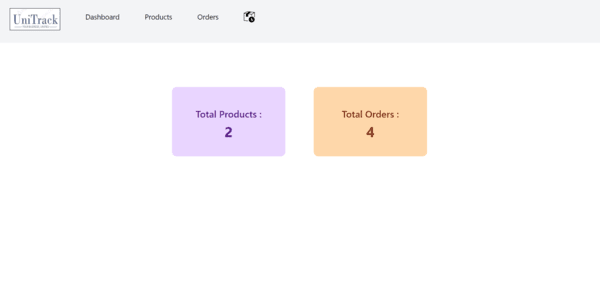
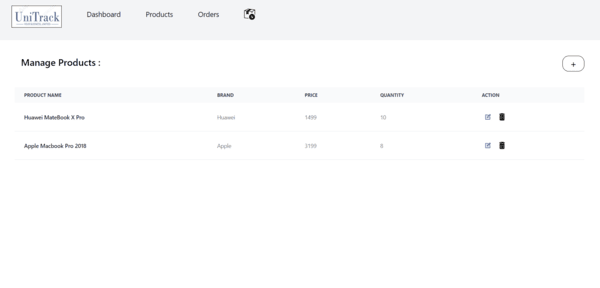
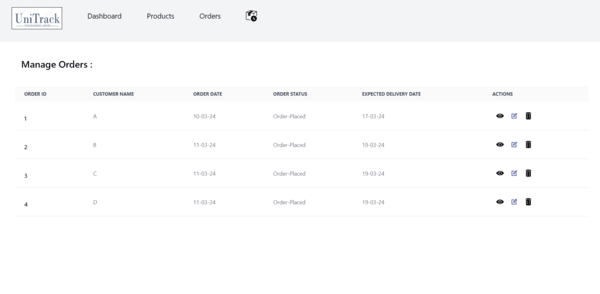
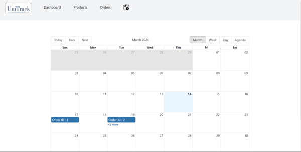

# UniTrack

FRONTEND - HTML/Tailwind CSS/JavaScript/React  Bundler - Parcel

A Simplified Enterprise Resource planning system that allows the business to manage its resources efficiently.

The initial details about the products and orders are fetched from their respective json files which have been created using mock data . 

Get access to your dashboard, manage the products and orders, view orders calendar and get relieved from all the mess and enjoy your business unified in one place.

The application is deployed and accessible at : https://uni-track-erp-pq19.vercel.app/

## Screenshots

## How to run the project?

1. Clone or download this repository to your local machine.
2. Install all the packages mentioned in the [package.json] file with the command `npm install` or `yarn install`
3. Open your terminal/command prompt from your project directory and run the project by executing the command `npm start`
4. Parcel will then set up a development environment where Parcel bundles your project, starts a development server and    provides various other features.
5. Access this server and you are all set!!.

